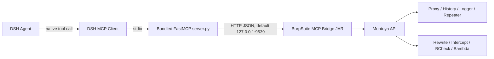

<div align="center">

# DSH BurpSuite MCP

将 Burp Suite 的 Proxy、Logger、History、Repeater、Rewrite、Intercept、BCheck 和 Bambda 能力接入 DeepSeek Harness 原生工具层。

[](https://github.com/6jeffr3y/dsh-burpsuite-mcp/releases)
[](https://github.com/topics/dsh-plugin)
[](https://portswigger.net/burp/pro)

</div>

## 核心优势

- **原生 DSH 工具**：通过官方 `@deepseek-ai/dsh-mcp-client` 注册 `mcp__burpsuite_mcp_bridge__*` 工具，不依赖模型手写 HTTP 请求。
- **低噪声流量检索**：先按目标、时间窗口、来源、注释和状态聚合候选流量，再按 `flowId` 获取完整请求与响应。
- **人工与 Agent 协作**：支持 Burp Selection、Repeater、注释、高亮、BCheck、Bambda 和其他扩展产生的 Logger-like 流量。
- **受控主动操作**：重放、原始请求、Rewrite 和双向 Intercept 支持 TTL、命中上限、自动禁用及 bounded pending queue。
- **运行时配置**：在 DSH Web 的“设置 → 插件 → 插件配置 → BurpSuite MCP”中修改桥接地址、工具超时和重连次数；保存后仅重启 MCP 子插件。
- **模型无关**：工具先进入 DSH 统一工具注册表，再由当前 LLM adapter 投影给支持原生工具调用的模型。

## 架构



DSH bundle 与 Burp 扩展分为两个进程。Bundle 内置 Python stdio MCP server；Burp JAR 在 Burp Suite 进程内提供本地 HTTP bridge。

## 版本与要求

| 组件 | 当前基线 |
| --- | --- |
| DSH bundle | `0.3.1` |
| DeepSeek Harness | `0.1.2-alpha.1` |
| Python MCP SDK | `mcp==1.26.0` |
| Burp bridge JAR | `2.1.0` |
| Burp Suite 实测版本 | Professional `2026.4.2-47702` |
| Montoya API 编译基线 | `2025.10` |
| JAR Build-Jdk-Spec | 21 |

## 安装

### 1. 安装 Burp 扩展

从 [v0.3.1 Release](https://github.com/6jeffr3y/dsh-burpsuite-mcp/releases/tag/v0.3.1) 下载：

```text
burpsuite-mcp-bridge-2.1.0-all.jar
```

在 Burp Suite 的 `Extensions → Installed → Add` 中选择该 JAR。推荐保持以下配置：

```text
Enabled: true
Bind host: 127.0.0.1
Port: 9639
Max live/logger entries: 1500
Max body preview bytes: 32768
```

JAR 的 SHA-256 为：

```text
efc986789d3eea8136a0ef95d1697104c02a2a21deb4ed43f07ba891e1e017bf
```

### 2. 安装 Python MCP SDK

```sh
python3 -m pip install 'mcp==1.26.0'
```

### 3. 安装 DSH bundle

```sh
dsh plugin --profile web add github:6jeffr3y/dsh-burpsuite-mcp#v0.3.1
```

重启 Web profile 后生效：

```sh
dsh web
```

> GitHub 安装直接使用仓库中提交的 `lib/` 和 `server.py`，不执行安装期构建脚本。需要固定供应链内容时，可以把版本标签替换为具体 commit SHA。

## 验证

先确认 Burp bridge 只在预期地址监听：

```sh
curl http://127.0.0.1:9639/health
```

再确认 DSH profile 已组合该 bundle：

```sh
dsh --profile web --dump-config
```

配置中应出现：

```yaml
- id: mcp-burpsuite-bridge
  name: dsh-plugin-burpsuite-mcp
```

新会话应能调用以下原生工具：

- `mcp__burpsuite_mcp_bridge__burp_bridge_status`
- `mcp__burpsuite_mcp_bridge__burp_target_overview`
- `mcp__burpsuite_mcp_bridge__burp_flow_get`

## 推荐工作流

1. 使用 `burp_bridge_status` 确认版本、监听地址、缓冲区和规则状态。
2. 对单个目标优先调用 `burp_target_overview(host=...)`，避免直接读取全部历史。
3. 使用 `source + flowId` 调用 `burp_flow_get` 获取决定性请求与响应。
4. 仅在需要验证时执行一次 `burp_replay_flow` 或 `burp_send_raw_request`。
5. 需要复用的自动化使用 Rewrite、BCheck 或 Bambda；临时规则设置 `ttl_seconds` 或 `max_matches`。
6. 使用 `burp_export_flow` 或 `burp_export_flow_bundle` 保存关键证据。

## 工具分组

| 类别 | 主要工具 |
| --- | --- |
| 状态与帮助 | `burp_bridge_status`, `burp_config_get`, `burp_mcp_list` |
| 流量聚合 | `burp_target_overview`, `burp_marked_flows`, `burp_extension_activity_overview` |
| 流量读取 | `burp_live_poll`, `burp_logger_poll`, `burp_history_search`, `burp_selection_poll`, `burp_flow_get` |
| 重放与证据 | `burp_replay_flow`, `burp_send_raw_request`, `burp_send_to_repeater`, `burp_export_flow` |
| 规则与拦截 | `burp_rules_list`, `burp_rule_upsert`, `burp_intercept_poll`, `burp_intercept_decide` |
| Burp 扩展 | `burp_bcheck_import`, `burp_bambda_import` |

`burp_bcheck_import.content` 接收 BCheck DSL 原文，不接收 JSON 或 Python 回调。多行规则可以先保存为 `.bcheck` 文件，再通过 `path` 导入。

## 配置

| 配置项 | 默认值 | 说明 |
| --- | --- | --- |
| `bridgeUrl` | `http://127.0.0.1:9639` | Burp bridge HTTP 地址 |
| `toolCallTimeoutMs` | `120000` | 单次 MCP 工具调用超时 |
| `reconnectMaxAttempts` | `10` | stdio server 中断后的最大重连次数 |

也可以在启动 DSH 前覆盖运行环境：

```sh
export DSH_BURP_MCP_PYTHON=python3
export DSH_BURP_MCP_SERVER=/absolute/path/to/server.py
export DSH_BURP_MCP_CWD=/absolute/working/directory
export BURP_MCP_BRIDGE_URL=http://127.0.0.1:9639
export BURP_MCP_PLUGIN_ROOT="$HOME/.dsh/burp-mcp"
```

WSL mirrored、Windows 本机和 macOS 本机通常可以使用 `127.0.0.1`。WSL NAT 需要把 `bridgeUrl` 指向 Windows 可达地址，并使用受控防火墙限制访问来源。

## 安全边界

Burp bridge 可以读取敏感 HTTP 流量并执行请求重放、改写和拦截。默认监听 `127.0.0.1`；不要把端口 `9639` 直接暴露到不可信网络。远程部署应在 bridge 之外提供认证、传输加密和来源访问控制。

列表和聚合工具默认返回 compact metadata。完整 body 仅在 detail、replay 或 export 操作中按需读取。导出文件写入 `$DSH_HOME/burp-mcp/artifacts`，不会自动提交到本仓库。

## 本地开发

```sh
git clone https://github.com/6jeffr3y/dsh-burpsuite-mcp.git
cd dsh-burpsuite-mcp
python3 -m pip install -r requirements.txt
npm install --ignore-scripts
npm run check
npm run pack:check
```

安装本地 checkout：

```sh
dsh plugin --profile web add link:$PWD
```

## License

本仓库及 Release 中的 Burp runtime artifacts 适用 [BurpSuite MCP Bridge Runtime Distribution License](LICENSE)。仅限授权安全测试与评估。
